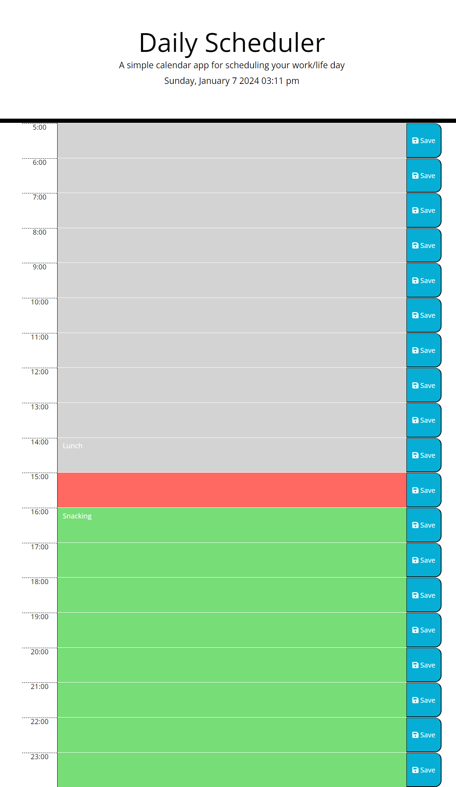

# daily-planner

## Description

A daily scheduler built with jQuery and Day.js library.

## Usage

Deployed URL: https://idareis.github.io/daily-planner/

- At first glance the application will give you the day of the week, day of the year and the hour.
- The current time is highlighted in red and the following hours in green.
- Input on the box at the time you have something to do and save it, it will stay even if refreshed and the time passed.

## Credits

Credits to <a href="https://github.com/Geoff7709">Geoffrey Zimmerman</a> for the help in developing this project.

  

## License

MIT.

Copyright (c) 2023 Ida Reis

Permission is hereby granted, free of charge, to any person obtaining a copy
of this software and associated documentation files (the "Software"), to deal
in the Software without restriction, including without limitation the rights
to use, copy, modify, merge, publish, distribute, sublicense, and/or sell
copies of the Software, and to permit persons to whom the Software is
furnished to do so, subject to the following conditions:

The above copyright notice and this permission notice shall be included in all
copies or substantial portions of the Software.

THE SOFTWARE IS PROVIDED "AS IS", WITHOUT WARRANTY OF ANY KIND, EXPRESS OR
IMPLIED, INCLUDING BUT NOT LIMITED TO THE WARRANTIES OF MERCHANTABILITY,
FITNESS FOR A PARTICULAR PURPOSE AND NONINFRINGEMENT. IN NO EVENT SHALL THE
AUTHORS OR COPYRIGHT HOLDERS BE LIABLE FOR ANY CLAIM, DAMAGES OR OTHER
LIABILITY, WHETHER IN AN ACTION OF CONTRACT, TORT OR OTHERWISE, ARISING FROM,
OUT OF OR IN CONNECTION WITH THE SOFTWARE OR THE USE OR OTHER DEALINGS IN THE
SOFTWARE.

## Badges

